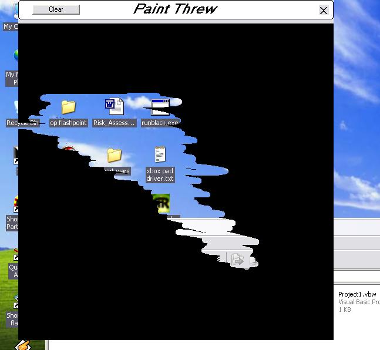



## Invisable paint

### Description

I had way to much time tomyself so I made an invisable paint program u paint threw the form, this has probally been done countless times already, worth alook not much code.
 
### More Info
 

             |
---                |---
**Submitted On**   |2005-04-16 16:27:06
**By**             |[Ste Dunn](https://github.com/Planet-Source-Code/PSCIndex/blob/master/ByAuthor/ste-dunn.md)
**Level**          |Intermediate
**User Rating**    |5.0 (10 globes from 2 users)
**Compatibility**  |VB 6\.0
**Category**       |[Miscellaneous](https://github.com/Planet-Source-Code/PSCIndex/blob/master/ByCategory/miscellaneous__1-1.md)
**World**          |[Visual Basic](https://github.com/Planet-Source-Code/PSCIndex/blob/master/ByWorld/visual-basic.md)
**Archive File**   |[Invisable\_1954051252005\.zip](https://github.com/Planet-Source-Code/ste-dunn-invisable-paint__1-63523/archive/master.zip)

